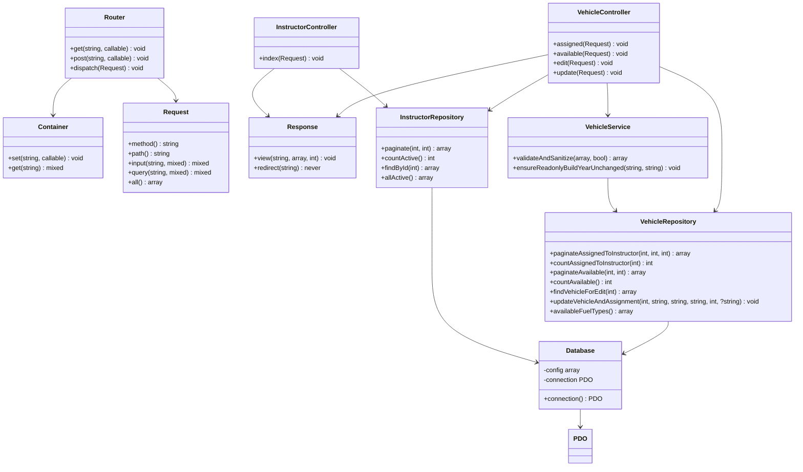

# Class Diagram

```mermaid
classDiagram
    class Container {
        +set(string, callable) void
        +get(string) mixed
    }

    class Database {
        -config array
        -connection PDO
        +connection() PDO
    }

    class Request {
        +method() string
        +path() string
        +input(string, mixed) mixed
        +query(string, mixed) mixed
        +all() array
    }

    class Response {
        +view(string, array, int) void
        +redirect(string) never
    }

    class Router {
        +get(string, callable) void
        +post(string, callable) void
        +dispatch(Request) void
    }

    class InstructorRepository {
        +paginate(int, int) array
        +countActive() int
        +findById(int) array
        +allActive() array
    }

    class VehicleRepository {
        +paginateAssignedToInstructor(int, int, int) array
        +countAssignedToInstructor(int) int
        +paginateAvailable(int, int) array
        +countAvailable() int
        +findVehicleForEdit(int) array
        +updateVehicleAndAssignment(int, string, string, string, int, ?string) void
        +availableFuelTypes() array
    }

    class VehicleService {
        +validateAndSanitize(array, bool) array
        +ensureReadonlyBuildYearUnchanged(string, string) void
    }

    class InstructorController {
        +index(Request) void
    }

    class VehicleController {
        +assigned(Request) void
        +available(Request) void
        +edit(Request) void
        +update(Request) void
    }

    Database --> PDO
    InstructorRepository --> Database
    VehicleRepository --> Database
    VehicleService --> VehicleRepository
    InstructorController --> InstructorRepository
    InstructorController --> Response
    VehicleController --> InstructorRepository
    VehicleController --> VehicleRepository
    VehicleController --> VehicleService
    VehicleController --> Response
    Router --> Container
    Router --> Request
```
