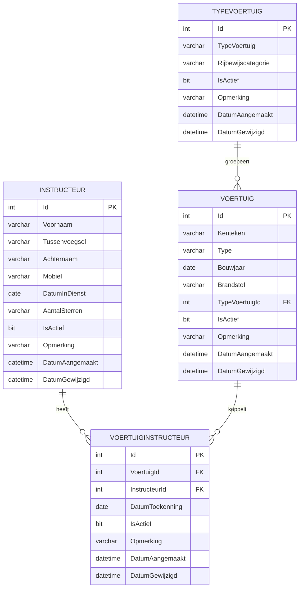

# ERD

```mermaid
erDiagram
    INSTRUCTEUR ||--o{ VOERTUIGINSTRUCTEUR : heeft
    VOERTUIG ||--o{ VOERTUIGINSTRUCTEUR : koppelt
    TYPEVOERTUIG ||--o{ VOERTUIG : groepeert

    INSTRUCTEUR {
        int Id PK
        varchar Voornaam
        varchar Tussenvoegsel
        varchar Achternaam
        varchar Mobiel
        date DatumInDienst
        varchar AantalSterren
        bit IsActief
        varchar Opmerking
        datetime DatumAangemaakt
        datetime DatumGewijzigd
    }

    TYPEVOERTUIG {
        int Id PK
        varchar TypeVoertuig
        varchar Rijbewijscategorie
        bit IsActief
        varchar Opmerking
        datetime DatumAangemaakt
        datetime DatumGewijzigd
    }

    VOERTUIG {
        int Id PK
        varchar Kenteken
        varchar Type
        date Bouwjaar
        varchar Brandstof
        int TypeVoertuigId FK
        bit IsActief
        varchar Opmerking
        datetime DatumAangemaakt
        datetime DatumGewijzigd
    }

    VOERTUIGINSTRUCTEUR {
        int Id PK
        int VoertuigId FK
        int InstructeurId FK
        date DatumToekenning
        bit IsActief
        varchar Opmerking
        datetime DatumAangemaakt
        datetime DatumGewijzigd
    }
```
